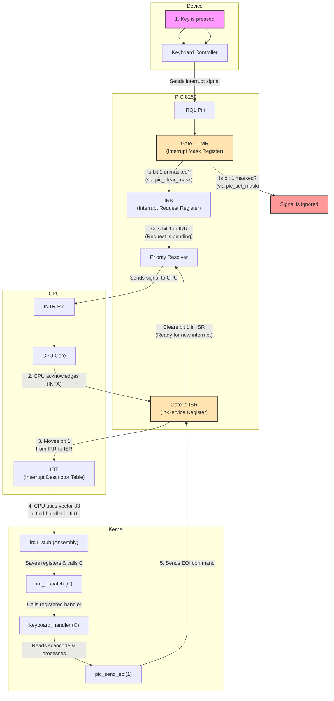

# Programmable Interrupt Controller

My NyanOS doesn't use PIC, but I still keep pic code in the `drivers/legacy` folders for the previous setup. The [pic.h](../src/drivers/legacy/pic.h) and [pic.c](../src/drivers/legacy/pic.c) are pretty clear in the documents.
Here is the diagram of the whole flows, as the concepts of Interrupt Request Register (IRR), In-service Register (ISR), and Interrupt Mask Register (IMR) are pretty confusing at first.

